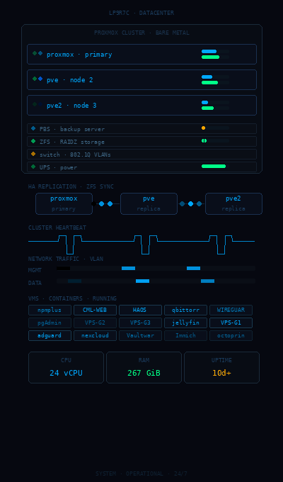

  

  <i>Homelab · self-hosting · infra qui tourne chez moi, sur du vrai matos.</i>

  

---

### salut 👋

Je bricole de l'infra. Pas du cloud managé, pas du mutualisé — du bare-metal que je monte, que je casse et que je remonte chez moi.

Tout ce qui tourne ici, je le gère de bout en bout : virtu, réseau, sécu, sauvegardes. C'est mon terrain de jeu, et accessoirement ce sur quoi repose mon petit hébergement, **L0CK7**.

L'idée c'est de faire les choses proprement : redondant quand ça compte, segmenté, monitoré, sans dépendre d'un fournisseur tiers pour le moindre service.

---

### ce qui tourne chez moi

Un cluster **Proxmox VE** multi-nœuds qui héberge la grosse partie de mes services :

* **Virtu** — VMs/CTs, migration live, réplication ZFS entre nœuds, snapshots automatisés.
* **Sauvegardes** — stratégie 3-2-1 avec **Proxmox Backup Server**, parce qu'un homelab sans backup c'est juste un crash en attente.
* **Stockage** — pools ZFS (mirror / RAIDZ), compression, scrubbing, monitoring d'intégrité.
* **Réseau** — VLANs pour isoler chaque workload, trunks 802.1Q, segmentation stricte.
* **Déploiement** — stacks Docker & K3s poussés via Ansible / Terraform au lieu de tout faire à la main.

| Couche | Ce que j'utilise |
| :--- | :--- |
| Hyperviseur | Proxmox VE (cluster + réplication ZFS) |
| Stockage | ZFS + PBS pour les backups |
| Réseau | VLANs · trunks 802.1Q · L2/L3 |
| Orchestration | Docker · K3s · Ansible · Terraform |
| Monitoring | Wazuh (SIEM/XDR) · logs centralisés |
| Privacy | Wireguard · AdGuard Home · Cloudflare |
| Secrets / proxy | Vaultwarden · Nginx Proxy Manager (SSL/TLS) |

---

### sécu & privacy

C'est le côté qui me branche le plus.

* **Wazuh** pour la détection d'intrusion, l'analyse de logs et le suivi de conformité.
* **Zero Trust** — tunnels Wireguard, rien d'exposé sans bonne raison, tout passe par du segmenté.
* **DNS** filtré et chiffré (DoH/DoT) via AdGuard Home, pas de fuite.
* **Vaultwarden** self-hosted pour les secrets, reverse proxy Nginx en SSL/TLS strict.
* **Hardening** systématique : SSH par clé uniquement, fail2ban, AppArmor, auditd.
* Un peu de **Nmap / Wireshark** quand je veux comprendre ce qui se passe vraiment sur le réseau.

---

### la stack

   
  

---

### les prochains trucs

- [ ] Pousser Proxmox plus loin : Ceph en stockage distribué, SDN
- [ ] CCNA 200-301 (en cours)
- [ ] Automatiser la gestion de parc réseau en Python (Netmiko / NAPALM)
- [ ] Du pentest plus poussé sur lab isolé (AD, Red Team)

---

> Au final ce qui me plaît c'est de construire des systèmes solides — redondants, sécurisés, auto-hébergés — et de comprendre comment ça marche jusqu'au bout. Tout ce que tu vois ici tourne pour de vrai, sur ma propre machine, maintenu au quotidien.
